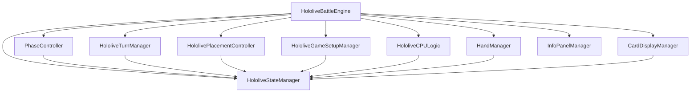
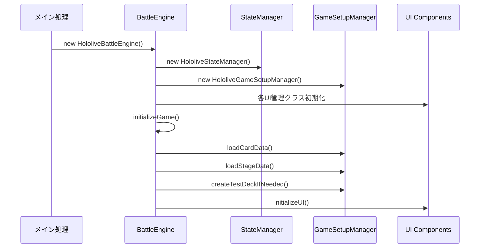
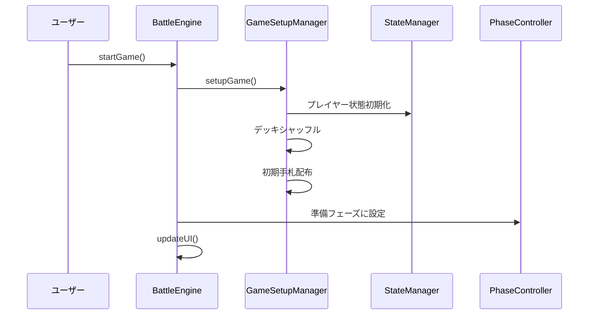
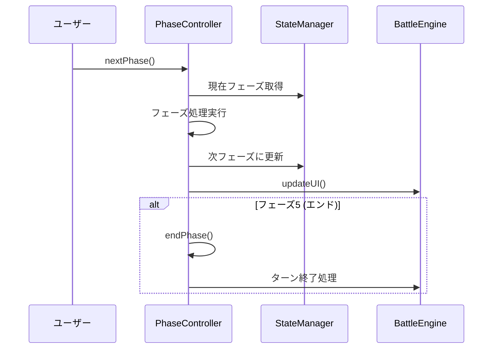
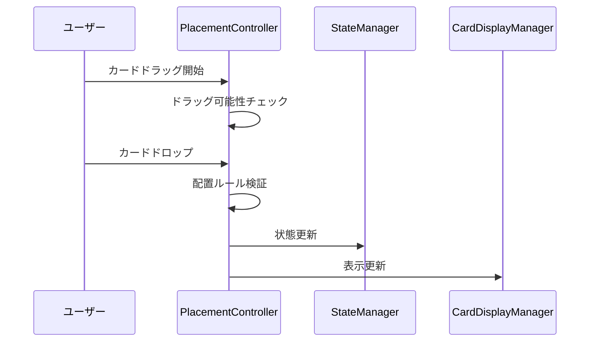

# バトルシミュレーター 詳細設計書

## 概要

ホロライブTCGバトルシミュレーターは、ホロライブカードゲームの対戦をブラウザ上で再現するアプリケーションです。

## アーキテクチャ概要

```
HololiveBattleEngine (メインエンジン)
├── HololiveStateManager (状態管理)
├── PhaseController (フェーズ制御)
├── HololiveTurnManager (ターン管理)
├── HololivePlacementController (配置制御)
├── HololiveGameSetupManager (ゲーム設定)
├── HololiveCPULogic (CPU思考)
├── HandManager (手札管理)
├── CardDisplayManager (カード表示)
└── InfoPanelManager (情報パネル)
```

## モジュール構成

| ファイル名 | クラス名 | 責務 |
|-----------|----------|------|
| js/battle_engine.js | HololiveBattleEngine | メインゲームエンジン、全体統括 |
| state-manager.js | HololiveStateManager | ゲーム状態の管理と永続化 |
| phase-controller.js | PhaseController | フェーズ進行とフェーズ間遷移 |
| turn-manager.js | HololiveTurnManager | ターン管理と終了処理 |
| placement-controller.js | HololivePlacementController | カード配置ロジック |
| game-setup-manager.js | HololiveGameSetupManager | ゲーム初期化とデッキ設定 |
| cpu_logic.js | HololiveCPULogic | AI思考ロジック |
| hand-manager.js | HandManager | 手札表示と管理 |
| card-display-manager.js | CardDisplayManager | カード描画とUI更新 |
| info-panel-manager.js | InfoPanelManager | 情報パネル表示 |

## 主要な依存関係



## ゲーム状態構造

```javascript
gameState = {
  gameStarted: boolean,
  currentPlayer: number, // 1 or 2
  currentPhase: number,  // -1=準備, 0=リセット, 1=ドロー, 2=エール, 3=メイン, 4=パフォーマンス, 5=エンド
  turn: number,
  isGameOver: boolean,
  winner: number,
  p1Ready: boolean,
  p2Ready: boolean
}

players[1/2] = {
  cards: {
    life: Card[],
    collab: Card | null,
    center: Card | null,
    oshi: Card | null,
    holoPower: Card[],
    deck: Card[],
    yellDeck: Card[],
    back1-5: Card | null,
    archive: Card[],
    hand: Card[]
  },
  gameState: {
    usedLimitedThisTurn: string[],
    restHolomem: Card[]
  },
  deckInfo: {
    oshiCard: Card,
    mainDeck: Card[],
    yellCards: Card[]
  }
}
```

## 初期化フロー



## ゲーム開始フロー



## フェーズ遷移フロー



## カード配置フロー



## 主要メソッド一覧

### HololiveBattleEngine
- `constructor()` - エンジン初期化
- `initializeGame()` - ゲーム初期化
- `startGame()` - ゲーム開始
- `resetGame()` - ゲームリセット
- `updateUI()` - UI全体更新
- `drawCard(playerId)` - カードドロー
- `placeCard(card, area)` - カード配置

### HololiveStateManager
- `getState()` - 状態取得
- `updateState(action, payload)` - 状態更新
- `saveState()` - 状態保存
- `loadState()` - 状態復元

### PhaseController
- `nextPhase()` - 次フェーズへ
- `getPhaseNameByIndex(index)` - フェーズ名取得
- `canAdvancePhase()` - フェーズ進行可能判定

### HololiveTurnManager
- `endTurn()` - ターン終了
- `nextTurn()` - 次ターンへ
- `resetTurnFlags()` - ターンフラグリセット

## イベントフロー

### カードクリック
1. ユーザーがカードクリック
2. `handleCardClick()` 呼び出し
3. カードタイプと現在フェーズをチェック
4. 適切なアクション実行（配置/使用/表示）

### フェーズ進行
1. ユーザーが「次のフェーズ」ボタンクリック
2. `PhaseController.nextPhase()` 呼び出し
3. 現在フェーズの終了処理
4. 次フェーズの開始処理
5. UI更新

### ターン終了
1. ユーザーが「ターン終了」ボタンクリック
2. `TurnManager.endTurn()` 呼び出し
3. ターン終了処理（リセット、クリーンアップ）
4. 相手ターンに切り替え
5. 新ターン開始処理

## 注意事項

- 状態管理は StateManager を通して行う
- UI更新は必ず updateUI() を経由する
- カード配置はルール検証を必須とする
- エラーハンドリングは各層で適切に実装
- ログ出力は統一された形式を使用

## 今後の拡張ポイント

- ネットワーク対戦機能
- リプレイ機能
- カスタムルール設定
- パフォーマンス最適化
- モバイル対応強化
