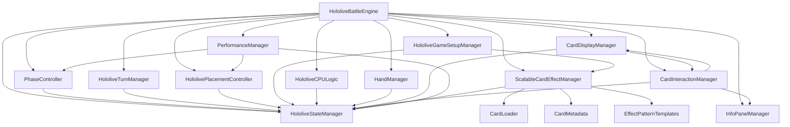
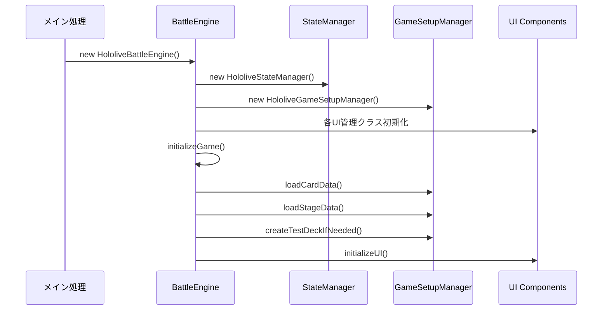
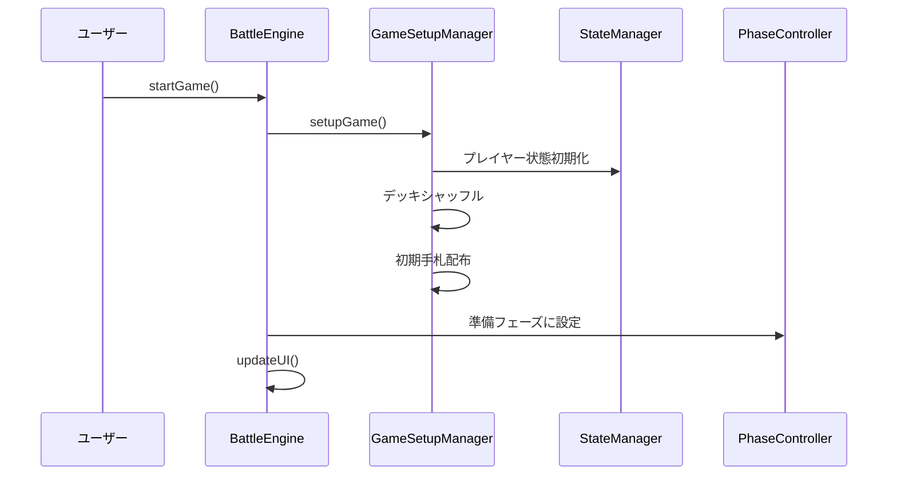
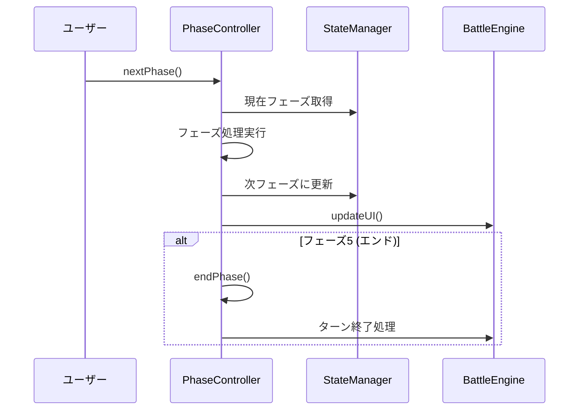
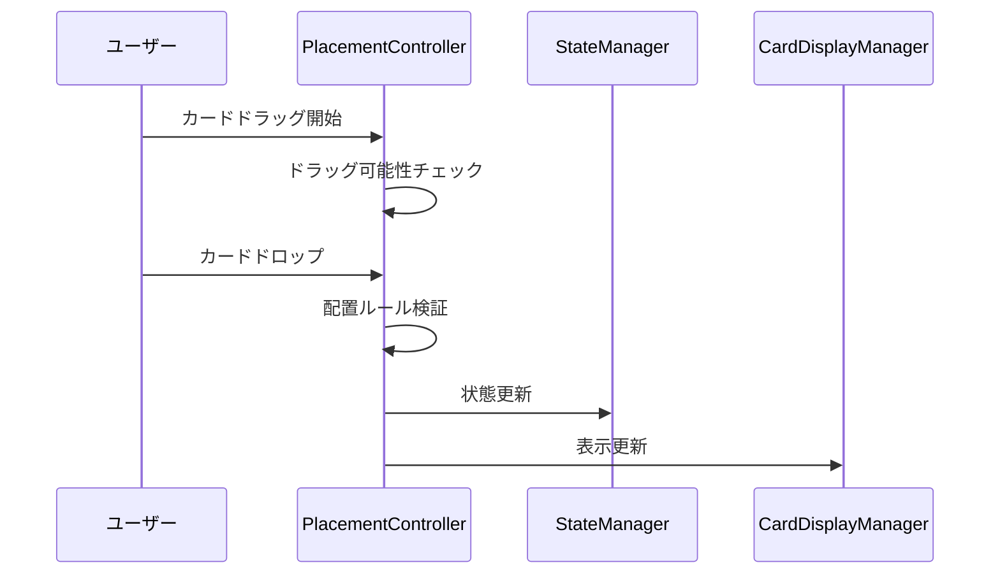

# バトルシミュレーター 詳細設計書

## 概要

ホロライブTCGバトルシミュレーターは、ホロライブカードゲームの対戦をブラウザ上で再現するWebアプリケーションです。
1000枚以上のカード効果に対応した拡張可能なアーキテクチャで設計されています。

## アーキテクチャ概要

```
HololiveBattleEngine (メインエンジン)
├── 🔄 状態管理レイヤー
│   └── HololiveStateManager (状態管理)
├── 🎮 ゲーム制御レイヤー  
│   ├── PhaseController (フェーズ制御)
│   ├── HololiveTurnManager (ターン管理)
│   ├── HololivePlacementController (配置制御)
│   └── HololiveGameSetupManager (ゲーム設定)
├── 🤖 AI制御レイヤー
│   └── HololiveCPULogic (CPU思考)
├── 🎨 UI管理レイヤー
│   ├── HandManager (手札管理)
│   ├── CardDisplayManager (カード表示・デバウンス処理)
│   ├── CardInteractionManager (カードインタラクション・アクションマーク)
│   └── InfoPanelManager (情報パネル)
├── ⚔️ バトル処理レイヤー
│   └── PerformanceManager (パフォーマンス・攻撃・スキル管理) ⭐主要機能
└── 🃏 カード効果システム（新アーキテクチャ）
    ├── ScalableCardEffectManager (メイン管理・遅延読み込み) ⭐新システム
    ├── CardEffectManager (レガシー互換・効果実行)
    ├── CardMetadata (軽量メタデータ管理) ⭐新規追加
    ├── CardLoader (動的読み込み制御) ⭐新規追加
    ├── EffectPatternTemplates (効果パターン) ⭐新規追加
    ├── CardEffectUtils (ユーティリティ関数) ⭐新規追加
    └── BattleEngineIntegration (エンジン統合) ⭐新規追加
```

## モジュール構成

| ファイル名 | クラス名 | 責務 |
|-----------|----------|------|
| js/battle_engine.js | HololiveBattleEngine | メインゲームエンジン、全体統括 |
| state-manager.js | HololiveStateManager | ゲーム状態の管理と永続化 |
| phase-controller.js | PhaseController | フェーズ進行とフェーズ間遷移、フェーズ定数管理 |
| turn-manager.js | HololiveTurnManager | ターン管理と終了処理、マリガン処理 |
| placement-controller.js | HololivePlacementController | カード配置ロジック、配置ルール管理 |
| game-setup-manager.js | HololiveGameSetupManager | ゲーム初期化とデッキ設定、テストデッキ作成 |
| cpu_logic.js | HololiveCPULogic | AI思考ロジック |
| hand-manager.js | HandManager | 手札表示と管理 |
| card-display-manager.js | CardDisplayManager | カード描画とUI更新、デバウンス処理 |
| card-interaction-manager.js | CardInteractionManager | カードクリック時の動作管理、アクションマーク表示 |
| info-panel-manager.js | InfoPanelManager | 情報パネル表示 |
| performance-manager.js | PerformanceManager | パフォーマンスステップ処理、攻撃・スキル管理 ⭐新規追加 |

### カード効果システム

| ファイル名 | クラス名 | 責務 |
|-----------|----------|------|
| card-effects/scalable-card-effect-manager.js | ScalableCardEffectManager | スケーラブルなカード効果管理、遅延読み込み ⭐メインシステム |
| card-effects/card-effect-manager.js | CardEffectManager | カード効果の登録と実行（レガシー互換） |
| card-effects/effect-registry.js | - | 効果の登録システム |
| card-effects/card-loader.js | - | カード効果の動的読み込み ⭐新規追加 |
| card-effects/card-metadata.js | - | カードメタデータの軽量管理 ⭐新規追加 |
| card-effects/effect-pattern-templates.js | - | 効果パターンテンプレート ⭐新規追加 |
| card-effects/card-effect-utils.js | - | カード効果ユーティリティ関数 ⭐新規追加 |
| card-effects/battle-engine-integration.js | - | バトルエンジン統合ヘルパー ⭐新規追加 |

## 主要な依存関係



## ゲーム状態構造

```javascript
// StateManagerで管理される状態構造（2024年8月更新版）
state = {
  // ゲーム全体の状態
  game: {
    started: boolean,
    ended: boolean,
    winner: number | null,
    turnOrderDecided: boolean,
    mulliganPhase: boolean,
    debutPlacementPhase: boolean
  },
  
  // ターン・フェーズ状態
  turn: {
    currentPlayer: number, // 1 or 2
    currentPhase: number,  // -1: 準備, 0-5: リセット〜エンド
    turnCount: number,
    firstPlayer: number | null,
    playerTurnCount: { 1: number, 2: number } // 各プレイヤーのターン回数
  },
  
  // マリガン状態
  mulligan: {
    count: { 1: number, 2: number },
    completed: { 1: boolean, 2: boolean }
  },
  
  // プレイヤー状態
  players: {
    1: PlayerState,
    2: PlayerState
  },
  
  // UI状態
  ui: {
    selectedCard: Card | null,
    highlightedAreas: string[],
    modalOpen: boolean,
    dragState: {
      isDragging: boolean,
      draggedCard: Card | null,
      dragSource: string | null,
      validDropZones: string[]
    },
    buttonsEnabled: {
      startGame: boolean,
      nextPhase: boolean,
      endTurn: boolean,
      resetGame: boolean
    }
  },
  
  // メタ情報
  meta: {
    lastUpdate: number,
    updateCount: number,
    version: string
  }
}

// プレイヤー状態（詳細）
PlayerState = {
  cards: {
    life: Card[],
    collab: Card | null,
    center: Card | null,
    oshi: Card | null,
    holoPower: Card[],
    deck: Card[],
    yellDeck: Card[],
    back1: Card | null,
    back2: Card | null,
    back3: Card | null,
    back4: Card | null,
    back5: Card | null,
    archive: Card[],
    hand: Card[]
  },
  gameState: {
    usedLimitedThisTurn: boolean,
    restHolomem: Card[],
    performedThisTurn: boolean, // パフォーマンス実行済みフラグ ⭐新規追加
    // カード効果の状態管理
    effectStates: {
      [cardId]: {
        bloomEffectUsed: boolean,
        collabEffectUsed: boolean,
        bloomedTurn: number,
        collabedTurn: number,
        justPlayed: boolean, // このターンに配置されたカード ⭐新規追加
        collabLocked: boolean // コラボロック状態 ⭐新規追加
      }
    }
  },
  deckInfo: {
    oshiCard: Card,
    mainDeck: Card[],
    yellCards: Card[]
  }
}
```

## 初期化フロー



## ゲーム開始フロー



## フェーズ遷移フロー



## カード配置フロー



## 主要メソッド一覧

### HololiveBattleEngine
- `constructor()` - エンジン初期化
- `initializeGame()` - ゲーム初期化
- `startGame()` - ゲーム開始
- `resetGame()` - ゲームリセット
- `updateUI()` - UI全体更新
- `drawCard(playerId)` - カードドロー
- `placeCard(card, area)` - カード配置

### HololiveStateManager
- `getState()` - 状態取得
- `updateState(action, payload)` - 状態更新
- `saveState()` - 状態保存
- `loadState()` - 状態復元

### PhaseController
- `nextPhase()` - 次フェーズへ
- `getPhaseNameByIndex(index)` - フェーズ名取得
- `canAdvancePhase()` - フェーズ進行可能判定

### HololiveTurnManager
- `endTurn()` - ターン終了
- `nextTurn()` - 次ターンへ
- `resetTurnFlags()` - ターンフラグリセット

## イベントフロー

### カードクリック
1. ユーザーがカードクリック
2. `handleCardClick()` 呼び出し
3. カードタイプと現在フェーズをチェック
4. 適切なアクション実行（配置/使用/表示）

### フェーズ進行
1. ユーザーが「次のフェーズ」ボタンクリック
2. `PhaseController.nextPhase()` 呼び出し
3. 現在フェーズの終了処理
4. 次フェーズの開始処理
5. UI更新

### ターン終了
1. ユーザーが「ターン終了」ボタンクリック
2. `TurnManager.endTurn()` 呼び出し
3. ターン終了処理（リセット、クリーンアップ）
4. 相手ターンに切り替え
5. 新ターン開始処理

## 注意事項

- 状態管理は StateManager を通して行う
- UI更新は必ず updateUI() を経由する
- カード配置はルール検証を必須とする
- エラーハンドリングは各層で適切に実装
- ログ出力は統一された形式を使用

## 更新履歴 ⭐新規追加

### 2024年8月更新
- **PerformanceManager**: パフォーマンスステップ専用管理クラス - 攻撃・スキル・ダメージ処理・ライフカード処理を統合管理
- **ScalableCardEffectManager**: 1000枚以上対応の大規模カード効果管理システム - 遅延読み込み・キャッシュ・メタデータ最適化・UI読み込み表示
- **StateManager**: 包括的な状態管理システム - プロキシベースの互換性レイヤー・リアルタイム状態追跡
- **PhaseController**: フェーズ定数・フェーズ検証・イベント発行機能を強化
- **CardInteractionManager**: アクションマーク表示・効果発動UI・カード詳細表示を統合
- **CardDisplayManager**: デバウンス処理・個別更新機能・メモリ最適化・差分更新
- **新しいカード効果サブシステム**:
  - **CardLoader**: カード効果の動的読み込み・バッチ処理・優先度制御
  - **CardMetadata**: 軽量メタデータ管理・効果パターン検出・パフォーマンス最適化
  - **EffectPatternTemplates**: 汎用効果テンプレートシステム・パターンマッチング
  - **CardEffectUtils**: カード効果共通ユーティリティ・ヘルパー関数群
  - **BattleEngineIntegration**: エンジン統合ヘルパー・状態管理連携
  - **CommonCards**: 高頻度採用カードの事前読み込みシステム ⭐新規追加

### カード効果読み込み最適化（2024年8月）⭐新規追加

#### 🚀 読み込みタイミングの最適化
- **ページ読み込み時**: 基本メタデータ + 高頻度カードの効果読み込み
- **ゲーム開始時**: デッキ固有のカード効果読み込み
- **デッキ選択時**: 読み込み処理なし（軽量化）

#### 📊 高頻度カード事前読み込み
- `common-cards.js`: よく採用されるカードの効果を事前定義
- エールカード、汎用サポート、人気推しホロメンを優先読み込み
- デッキ構築時の体感速度向上

#### 🎨 UI読み込み表示
- プログレス付きローディングオーバーレイ
- 読み込み状況のリアルタイム表示
- ユーザビリティの向上

### アーキテクチャの改善点

#### 🔄 状態管理の一元化
- 全状態をStateManagerで一元管理
- プロキシベースの自動更新・通知システム
- 変更履歴の追跡とデバッグ支援

#### ⚡ パフォーマンス最適化
- カード効果の遅延読み込み（必要時のみ）
- メタデータによる軽量化（重い処理の分離）
- UI更新のデバウンス処理
- バッチ処理による効率化

#### 🎯 モジュラー設計の強化
- 責務の明確な分離（表示・処理・状態）
- プラグイン形式のカード効果システム
- 疎結合なイベント駆動アーキテクチャ

#### 🛡️ エラーハンドリング・デバッグ強化
- 段階的フォールバック処理
- 詳細なログ・デバッグ情報
- リアルタイム状態監視

#### 📈 拡張性・保守性
- 新カード追加の簡易化（ファイル追加のみ）
- 効果パターンの再利用可能化
- テスト・デバッグの容易化

## 今後の拡張ポイント

- ネットワーク対戦機能
- リプレイ機能
- カスタムルール設定
- パフォーマンス最適化
- モバイル対応強化
