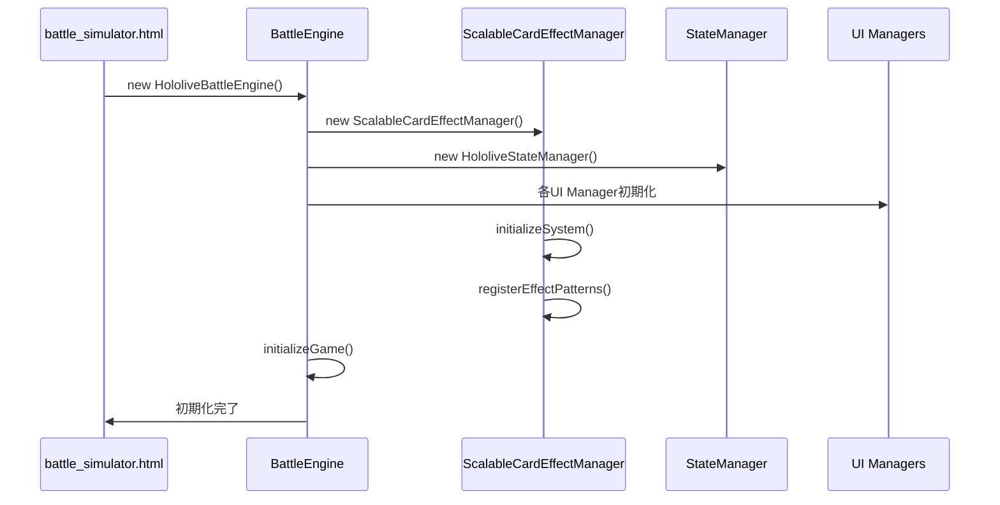
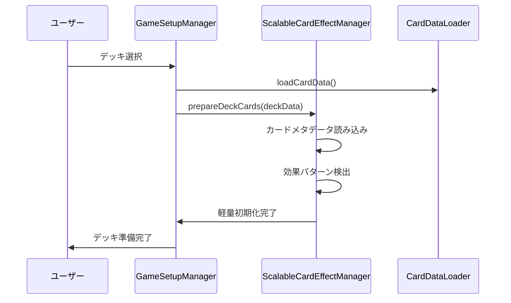
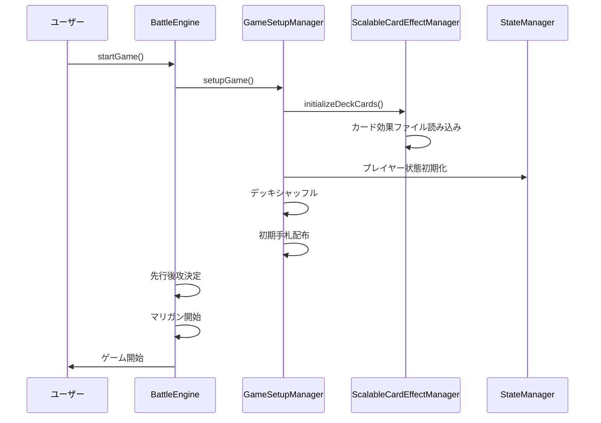
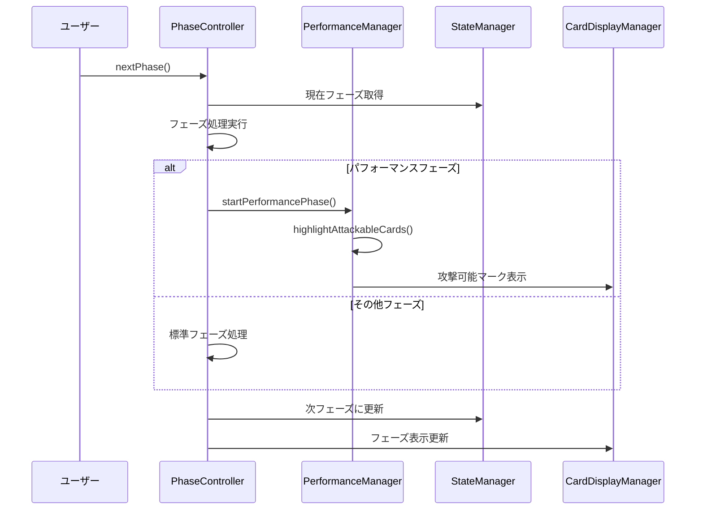
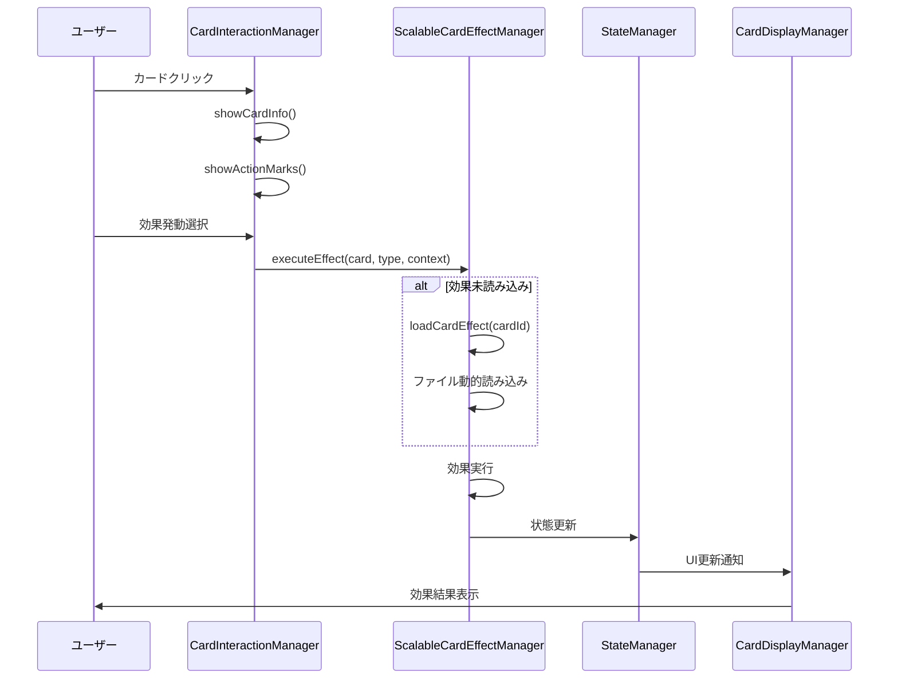
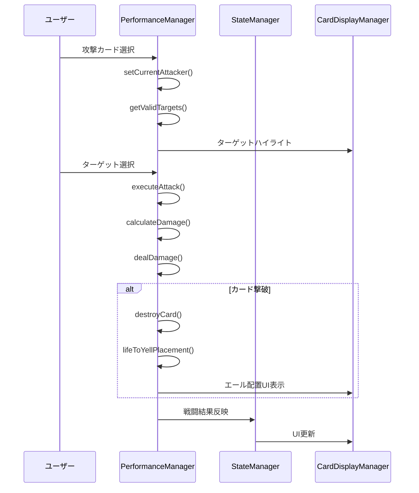
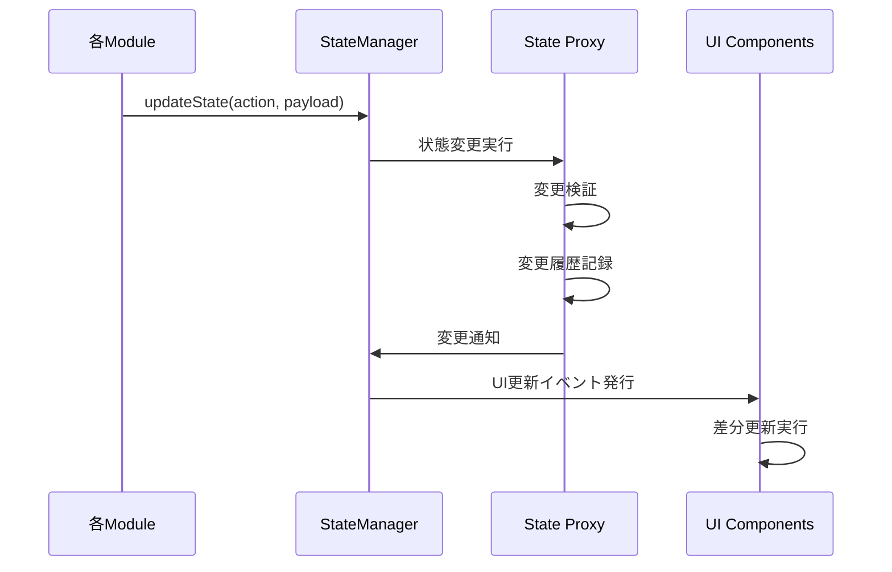

# バトルシミュレーター 実装フロー詳細

## 実装フロー概要

バトルシミュレーターの実装は以下の順序で実行されます：

```
1. システム初期化 → 2. デッキ準備 → 3. ゲーム開始 → 4. ターン実行 → 5. 勝利判定
```

## 1. システム初期化フロー

### 1.1 アプリケーション起動


### 1.2 カード効果システム初期化
```javascript
// ScalableCardEffectManager初期化
async initializeSystem() {
  // 1. 効果パターンテンプレート登録
  this.registerEffectPatterns();
  
  // 2. メタデータキャッシュ準備
  this.cardMetadata = new Map();
  
  // 3. 動的読み込みシステム準備
  this.loadedEffects = new Set();
  
  console.log('✅ カード効果システム初期化完了');
}
```

## 2. デッキ準備フロー

### 2.1 デッキ選択時の軽量初期化


### 2.2 メタデータ事前読み込み
```javascript
// デッキカードのメタデータを事前読み込み
async prepareDeckCards(deckData) {
  const cardIds = this.extractCardIds(deckData);
  
  for (const cardId of cardIds) {
    // 軽量メタデータのみ読み込み
    await this.loadCardMetadata(cardId);
  }
  
  console.log(`📋 ${cardIds.size}枚のカードメタデータ準備完了`);
}
```

## 3. ゲーム開始フロー

### 3.1 ゲーム開始処理


### 3.2 カード効果本格初期化
```javascript
// ゲーム開始時のカード効果初期化
async initializeDeckCards(deckData) {
  const cardIds = this.extractCardIds(deckData);
  const highPriorityCards = this.getHighPriorityCards(cardIds);
  
  // 高優先度カードを先に読み込み
  for (const cardId of highPriorityCards) {
    await this.loadCardEffect(cardId);
  }
  
  // 残りは必要時に遅延読み込み
  console.log(`🃏 ${highPriorityCards.length}枚の効果を事前読み込み`);
}
```

## 4. ターン実行フロー

### 4.1 フェーズ進行システム


### 4.2 カード効果発動フロー


### 4.3 攻撃処理フロー


## 5. 状態管理フロー

### 5.1 状態更新システム


### 5.2 デバウンス処理
```javascript
// CardDisplayManagerでのデバウンス処理
updateCardAreas() {
  if (this.updateDebounceTimer) {
    clearTimeout(this.updateDebounceTimer);
  }
  
  this.updateDebounceTimer = setTimeout(() => {
    this.performActualUpdate();
    this.updateDebounceTimer = null;
  }, 16); // 60FPS相当
}
```

## 6. エラーハンドリング・フォールバック

### 6.1 段階的エラーハンドリング
```javascript
// ScalableCardEffectManagerでのエラーハンドリング
async executeEffect(card, triggerType, context) {
  try {
    // メイン処理
    const effect = await this.loadCardEffect(card.id);
    return await effect.execute(card, context, this.battleEngine);
    
  } catch (primaryError) {
    console.warn(`[Effect] 効果実行失敗: ${card.id}`, primaryError);
    
    try {
      // フォールバック: パターン効果
      const pattern = this.detectEffectPattern(card);
      return await this.executePatternEffect(card, pattern, context);
      
    } catch (fallbackError) {
      console.error(`[Effect] フォールバック失敗: ${card.id}`, fallbackError);
      
      // 最終フォールバック: 効果なし
      return { 
        success: false, 
        reason: '効果実行に失敗しました',
        fallback: true 
      };
    }
  }
}
```

### 6.2 UI更新エラー対応
```javascript
// CardDisplayManagerでのエラー対応
displayCardsInArea(area, cards, areaId, playerId) {
  try {
    this.performCardDisplay(area, cards, areaId, playerId);
  } catch (error) {
    console.error(`[Display] カード表示エラー: ${areaId}`, error);
    
    // フォールバック: 最小限表示
    this.displayMinimalCards(area, cards, areaId);
    
    // エラー報告
    this.reportDisplayError(error, areaId);
  }
}
```

## 7. パフォーマンス最適化実装

### 7.1 遅延読み込み戦略
```javascript
// 必要時のみカード効果を読み込み
async loadCardEffect(cardId) {
  // キャッシュ確認
  if (this.loadedEffects.has(cardId)) {
    return this.effectRegistry.get(cardId);
  }
  
  // メタデータで判定
  const metadata = await this.loadCardMetadata(cardId);
  if (!metadata.hasCustomEffect) {
    return this.getPatternEffect(metadata.effectPattern);
  }
  
  // 動的読み込み実行
  return await this.loadCustomEffect(cardId);
}
```

### 7.2 バッチ処理実装
```javascript
// 複数カードの並列読み込み
async batchLoadEffects(cardIds) {
  const batchSize = this.batchSize;
  const results = [];
  
  for (let i = 0; i < cardIds.length; i += batchSize) {
    const batch = cardIds.slice(i, i + batchSize);
    const batchResults = await Promise.all(
      batch.map(cardId => this.loadCardEffect(cardId))
    );
    results.push(...batchResults);
  }
  
  return results;
}
```

## 8. デバッグ・監視システム

### 8.1 リアルタイム状態監視
```javascript
// StateManagerでの状態変更追跡
updateState(action, payload) {
  const before = this.getStateSnapshot();
  
  try {
    this.performStateUpdate(action, payload);
    const after = this.getStateSnapshot();
    
    // 変更ログ
    this.logStateChange(action, before, after);
    
    // パフォーマンス監視
    this.updatePerformanceMetrics(action);
    
  } catch (error) {
    this.handleStateError(error, action, payload);
  }
}
```

### 8.2 詳細ログシステム
```javascript
// 統一ログフォーマット
log(level, module, message, data = {}) {
  const timestamp = new Date().toISOString();
  const logEntry = {
    timestamp,
    level,
    module,
    message,
    data,
    gameState: this.getGameStateContext()
  };
  
  console[level](`[${module}] ${message}`, data);
  this.logHistory.push(logEntry);
}
```

この実装フローにより、バトルシミュレーターは拡張性とパフォーマンスを両立した堅牢なシステムとして動作します。
