# 状態遷移とフロー詳細

## ゲーム全体の状態遷移

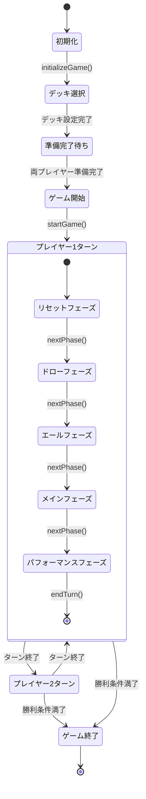

## フェーズ詳細フロー

### リセットフェーズ (Phase: 'reset')
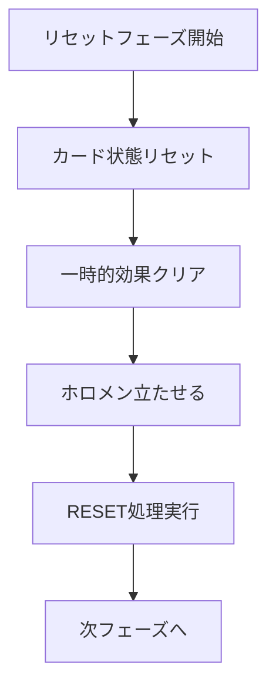

### ドローフェーズ (Phase: 'draw')
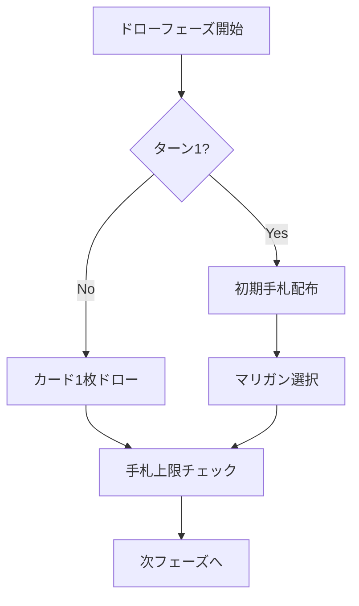

### エールフェーズ (Phase: 'cheer')
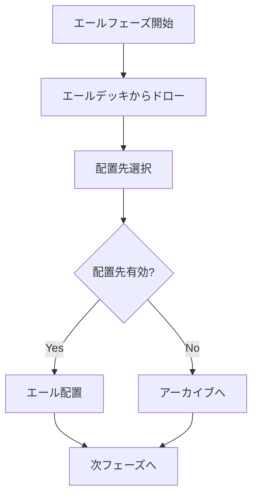

### メインフェーズ (Phase: 'main')
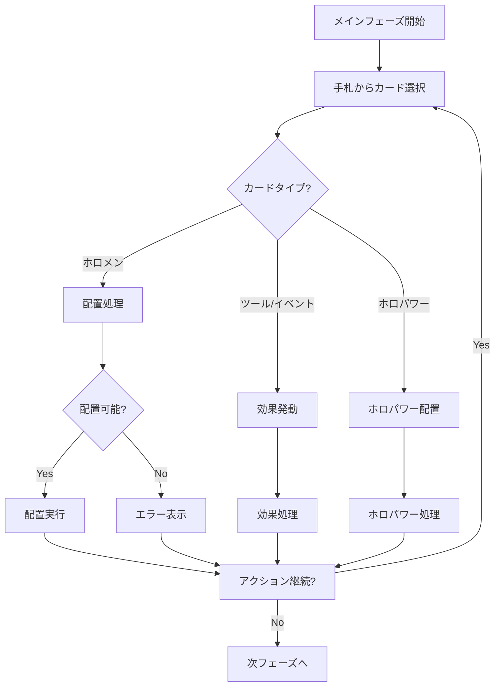

### パフォーマンスフェーズ (Phase: 'performance')
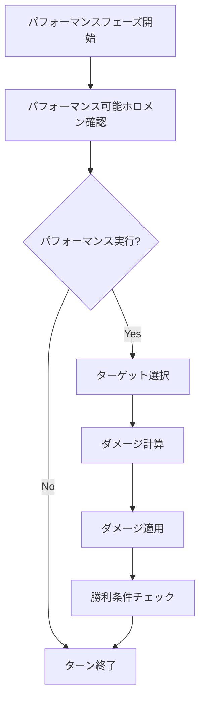
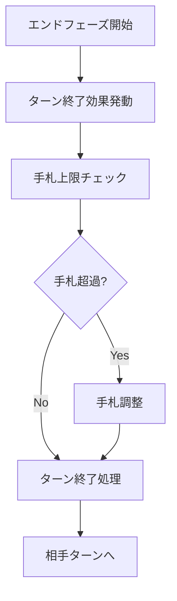

## カード配置フロー

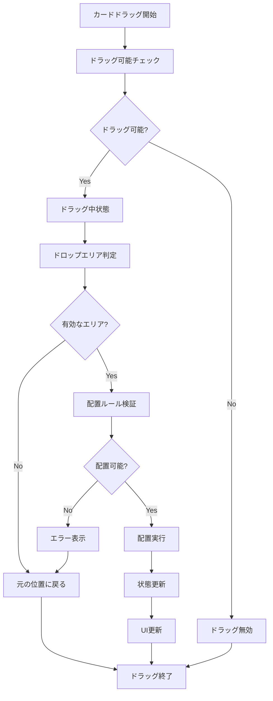

## AI思考フロー

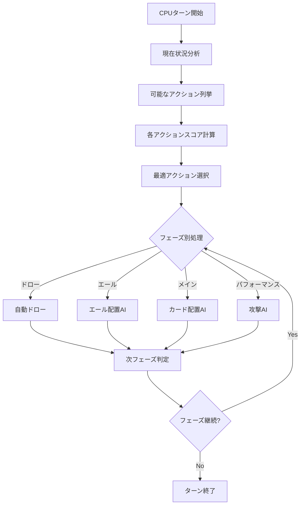

## データフロー

### 状態更新フロー
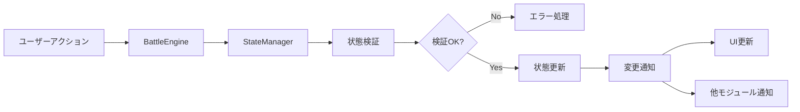

### カード表示更新フロー
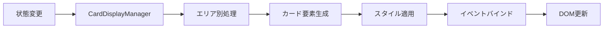

## イベント処理チェーン

### カードクリックイベント（新システム）
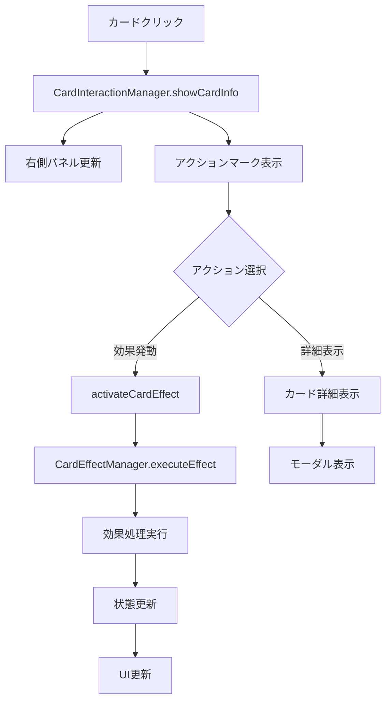

### カード効果発動フロー
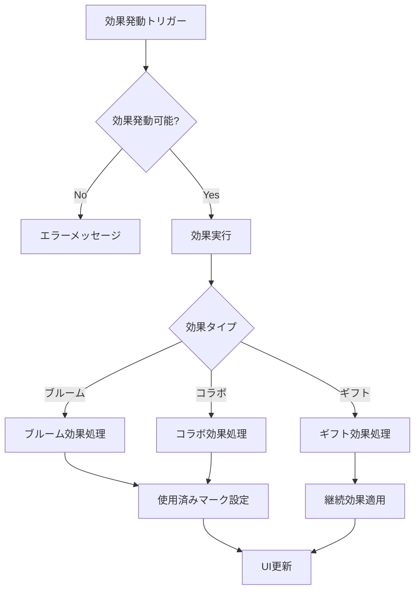

### カードクリックイベント（レガシー）
1. `card.addEventListener('click')` - カード要素
2. `handleCardClick()` - BattleEngine
3. `validateAction()` - PhaseController
4. `executeAction()` - PlacementController
5. `updateState()` - StateManager
6. `updateUI()` - BattleEngine

### フェーズ進行イベント
1. `nextPhaseBtn.addEventListener('click')` - ボタン
2. `nextPhase()` - PhaseController
3. `executePhase()` - PhaseController
4. `updateState()` - StateManager
5. `updateUI()` - BattleEngine
6. `updatePhaseHighlight()` - UI更新

### ターン終了イベント
1. `endTurnBtn.addEventListener('click')` - ボタン
2. `endTurn()` - TurnManager
3. `switchPlayer()` - TurnManager
4. `resetTurnFlags()` - TurnManager
5. `updateState()` - StateManager
6. `updateUI()` - BattleEngine

## エラーハンドリングフロー

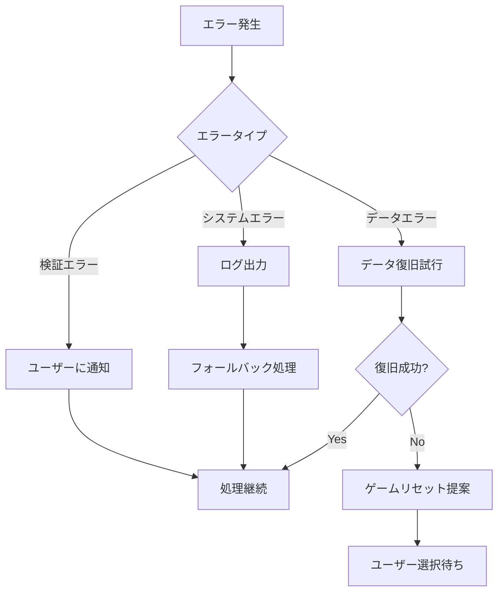

## パフォーマンス最適化ポイント

1. **状態更新の最適化**
   - 不要な更新の抑制
   - バッチ更新の実装

2. **UI更新の最適化**
   - Virtual DOM的な差分更新
   - アニメーション最適化

3. **メモリ管理**
   - イベントリスナーの適切な削除
   - オブジェクト参照の管理

4. **非同期処理**
   - カードデータ読み込みの最適化
   - 重い処理の分割
