# 状態遷移とフロー詳細 - 2024年8月更新版

## ゲーム全体の状態遷移

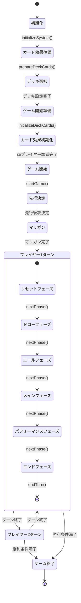

## フェーズ詳細フロー

### リセットフェーズ (Phase: 'reset')
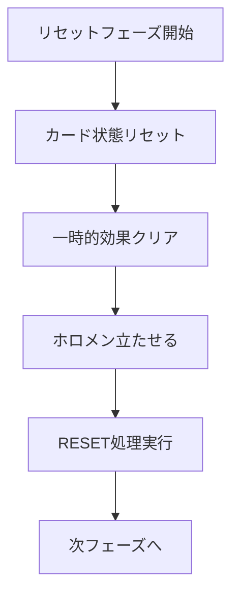

### ドローフェーズ (Phase: 'draw')
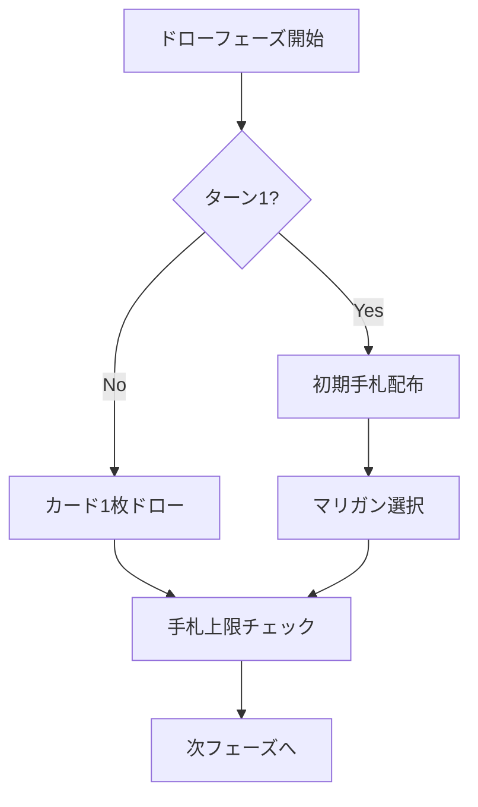

### エールフェーズ (Phase: 'cheer')
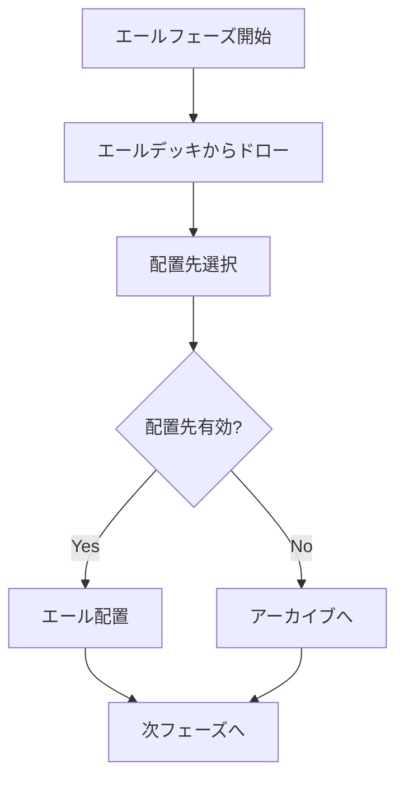

### メインフェーズ (Phase: 'main')
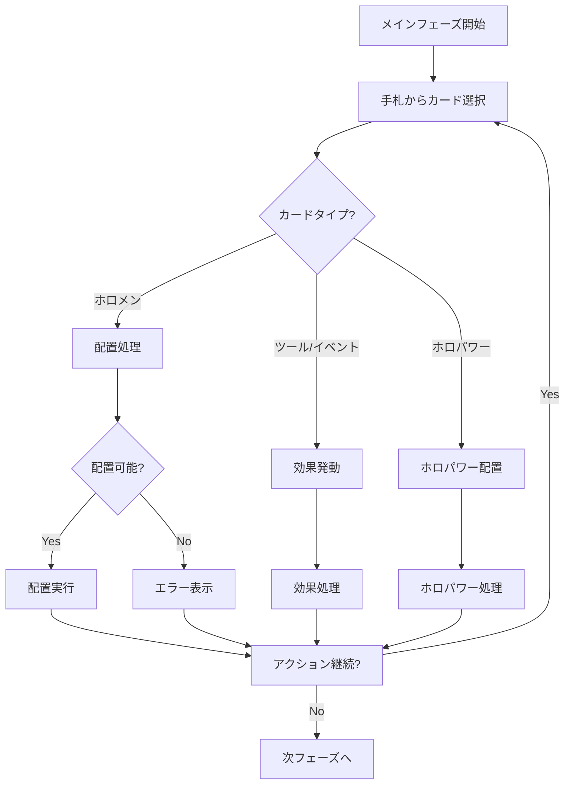

### パフォーマンスフェーズ (Phase: 'performance') ⭐更新
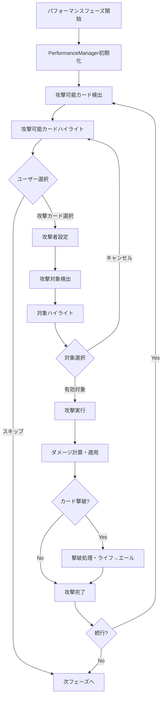

### エンドフェーズ (Phase: 'end') ⭐新規追加
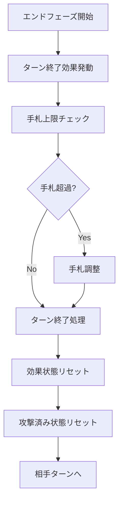

## カード効果発動フロー ⭐新システム

### 効果発動システム全体フロー
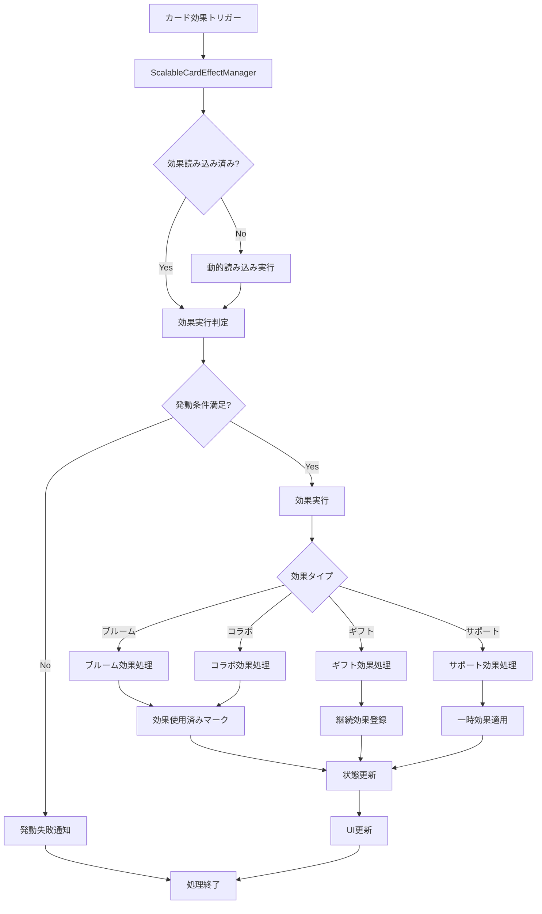

### カード効果動的読み込みフロー
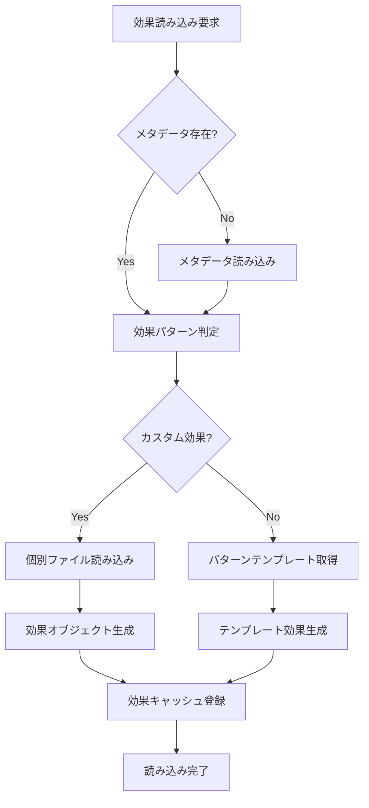

## カード配置フロー ⭐更新

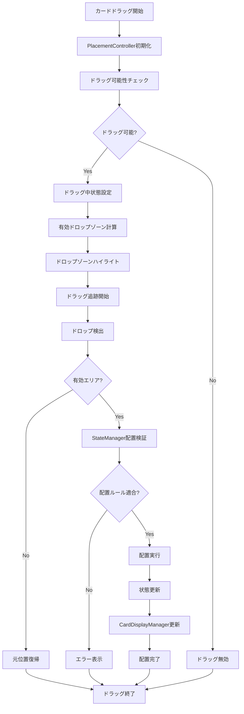

## AI思考フロー ⭐更新

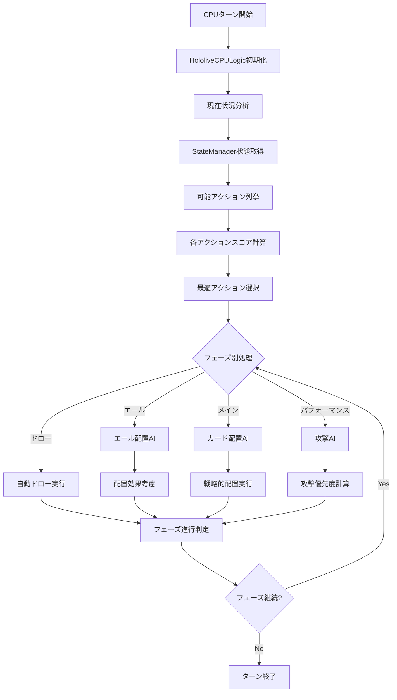

## データフロー ⭐大幅更新

### 状態更新フロー（新アーキテクチャ）
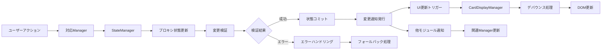

### カード表示更新フロー（最適化版）
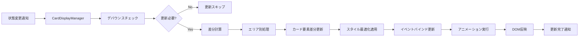

### カード効果実行データフロー
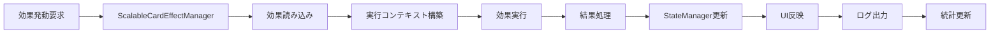

## イベント処理チェーン ⭐大幅更新

### カードクリックイベント（新統合システム）
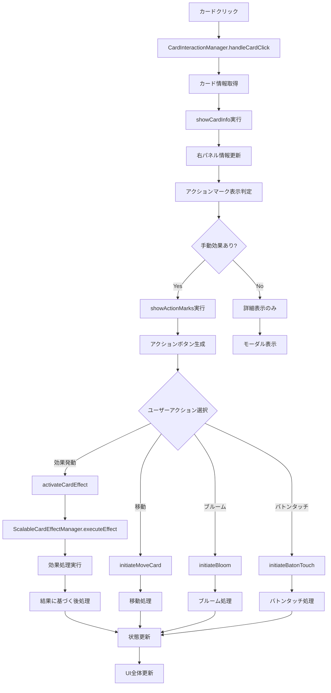

### フェーズ進行イベント（強化版）
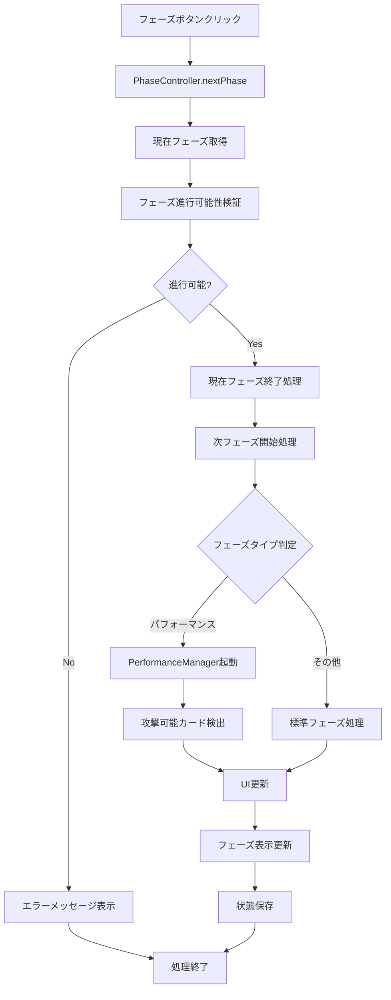

### ターン終了イベント（統合処理）
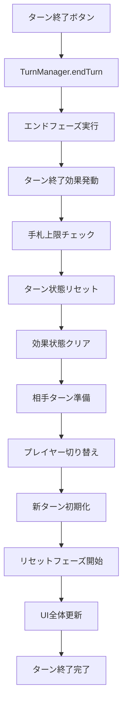

### カード効果チェーン（新システム）
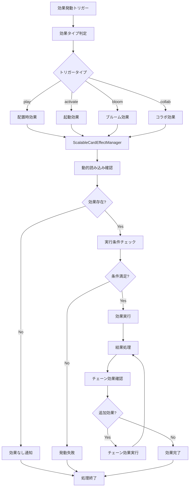

## エラーハンドリングフロー ⭐大幅強化

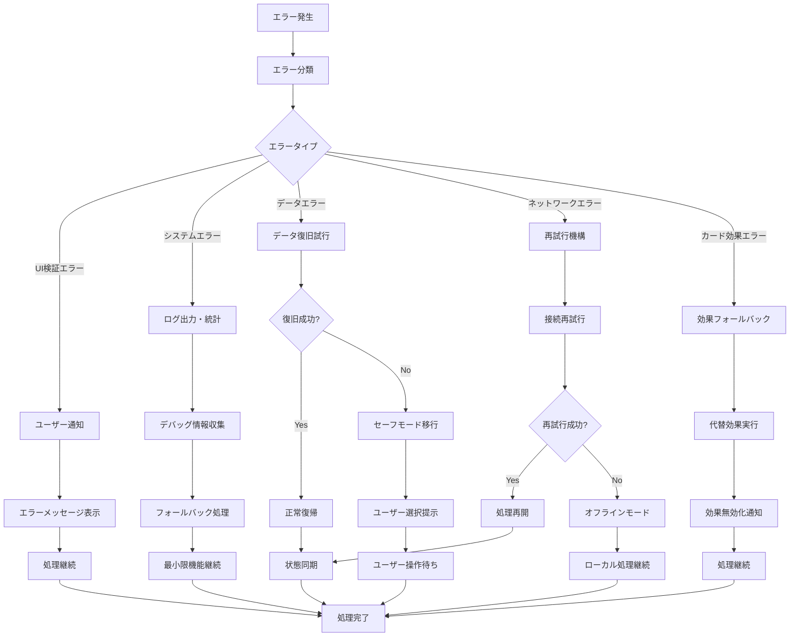

## パフォーマンス最適化ポイント ⭐新規追加

### 1. カード効果システム最適化
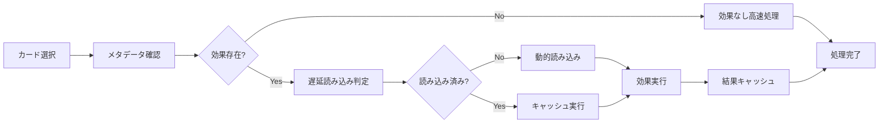

### 2. UI更新最適化
```mermaid
flowchart LR
    A[状態変更] --> B[デバウンス判定]
    B --> C{更新必要?}
    C -->|No| D[更新スキップ]
    C -->|Yes| E[差分計算]
    E --> F[最小限更新]
    F --> G[DOM最適化]
    G --> H[更新完了]
    D --> H
```

### 3. メモリ管理最適化
- **カード効果の自動アンロード**: 使用頻度の低い効果を自動解放
- **イベントリスナーの適切な管理**: メモリリーク防止
- **DOM要素の再利用**: 不要な生成を削減
- **キャッシュサイズ制限**: メモリ使用量の制御

### 4. 非同期処理最適化
- **バッチ読み込み**: 複数カード効果の並列読み込み
- **優先度付きキュー**: 重要な処理を優先実行
- **タイムスライシング**: 重い処理の分割実行
- **プリロード戦略**: 予測的な事前読み込み
